<p align="center">
  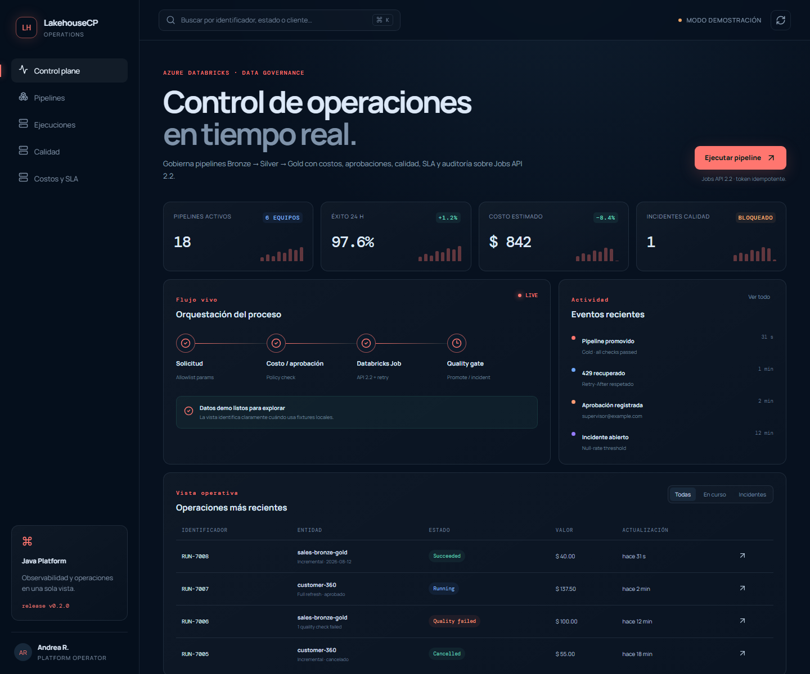
</p>

<h1 align="center">Lakehouse Control Plane</h1>

<p align="center"><i>Gobierno de ejecuciones Azure Databricks con costos,
aprobaciones, calidad, reintentos y auditoría desde Java.</i></p>

<p align="center">
  <a href="https://github.com/danielyatacoblas/lakehouse-control-plane/actions/workflows/ci.yml"></a>
  
  
  
  
  
  
  <a href="LICENSE"></a>
</p>

---

## Qué es

Ejecutar un notebook no basta para gobernar una plataforma de datos. Un
`full refresh` puede multiplicar el costo, un parámetro libre puede cambiar
el origen equivocado y un pipeline con calidad fallida no debería promoverse a
Gold aunque Databricks marque el job como terminado.

**Lakehouse Control Plane pone políticas delante de Jobs API 2.2.** Valida un
catálogo permitido, calcula costo, solicita aprobación cuando corresponde,
dispara la ejecución con token idempotente, recupera throttling HTTP 429 y
convierte resultados de calidad en promoción o incidente auditable.

---

## Probarlo sin una cuenta de Azure

La consola web funciona de inmediato con datos sintéticos:

```bash
git clone https://github.com/danielyatacoblas/lakehouse-control-plane.git
cd lakehouse-control-plane/frontend
npm ci
npm run dev
```

Abrir `http://localhost:5180`. No se requieren credenciales, tokens ni gasto
de Azure. La UI identifica el modo demostración.

El backend también incluye un simulador local de Jobs API, por lo que todo el
flujo puede ejecutarse sin Databricks real.

---

## Funcionalidades

1. Catálogo de pipelines y allowlist de parámetros.
2. Token de idempotencia igual al UUID interno de ejecución.
3. Estimación de costo antes de disparar el job.
4. `full refresh` con multiplicador 2.5× y aprobación por umbral.
5. Integración Jobs API 2.2 con polling.
6. Retry con backoff y respeto de `Retry-After` ante HTTP 429.
7. Quality gates que bloquean promoción y crean incidentes.
8. Cancelación y aprobación protegidas por rol.
9. Auditoría PostgreSQL, dashboard, health y Prometheus.
10. Bicep para Azure Container Apps con Managed Identity.

---

## Capturas

| Pantalla | Claro | Oscuro |
|---|---|---|
| Control plane | 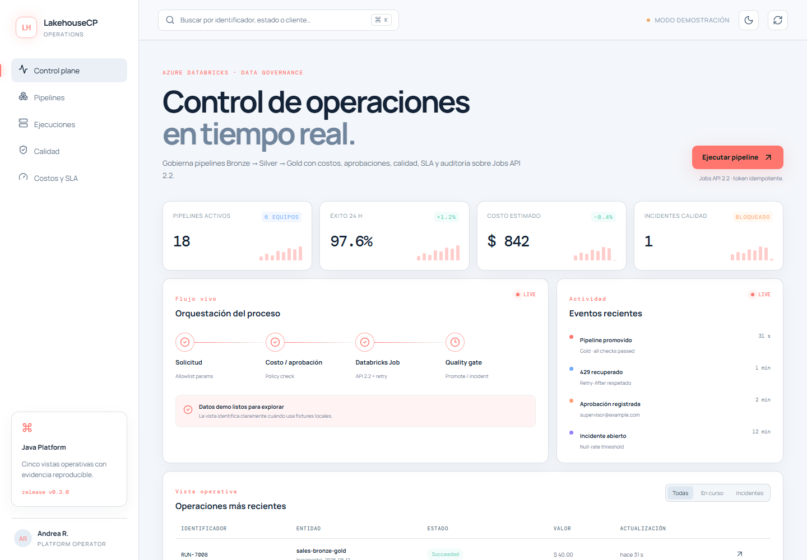 | 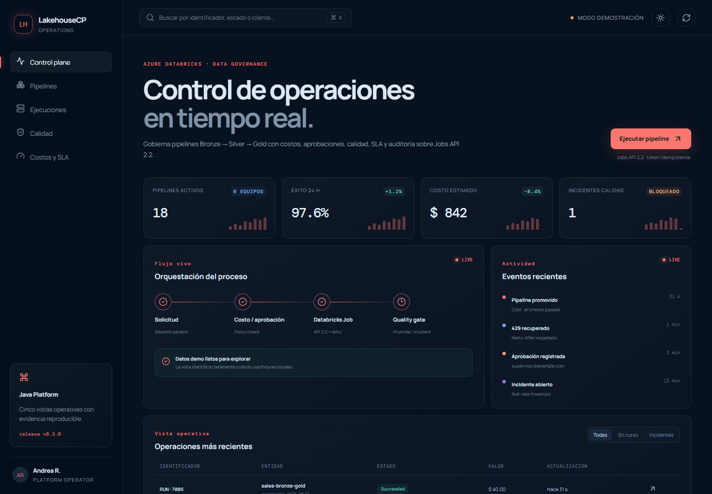 |
| Pipelines | 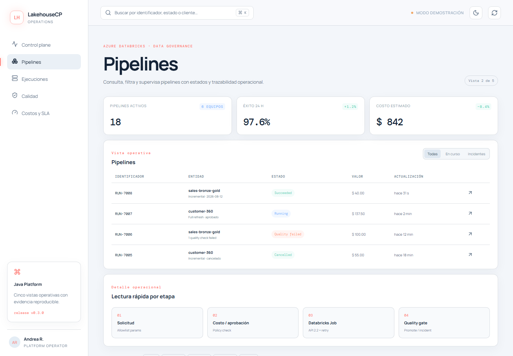 | 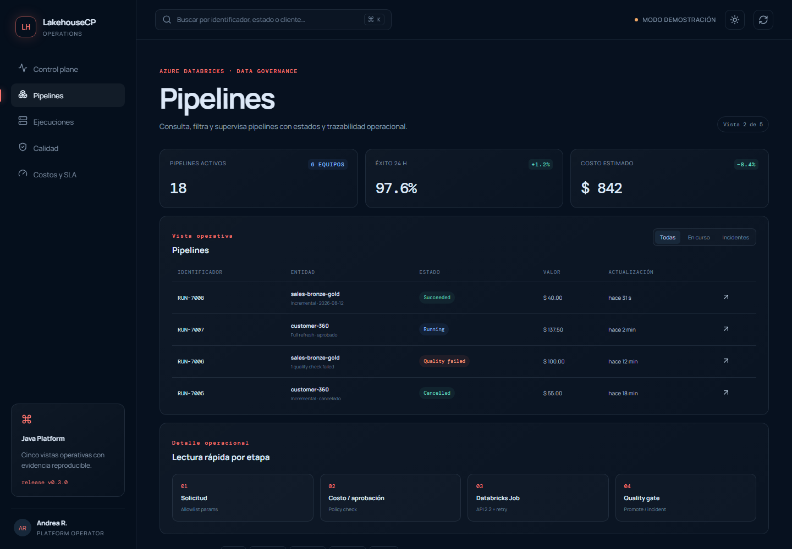 |
| Ejecuciones | 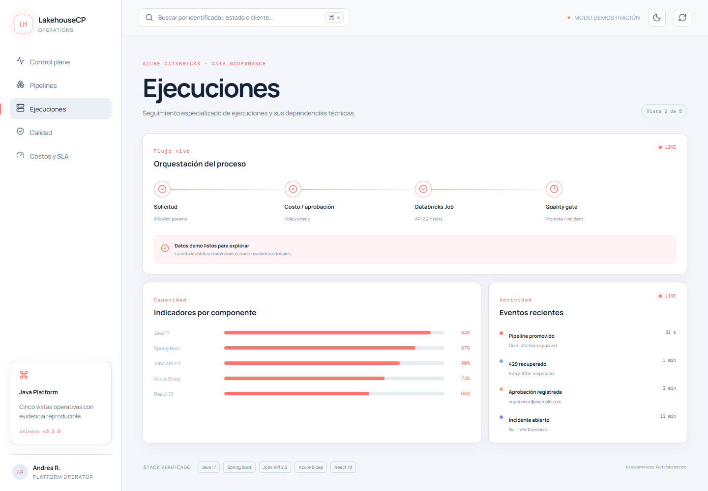 | 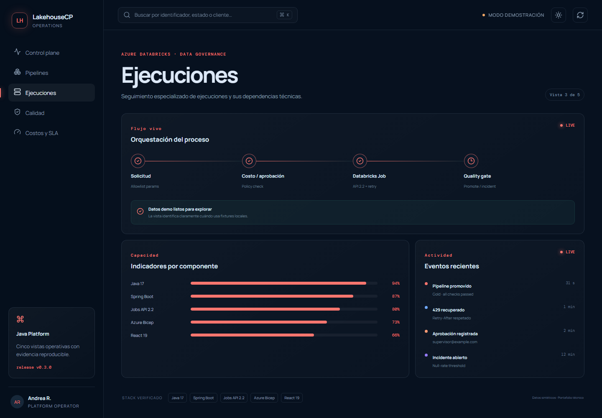 |
| Calidad | 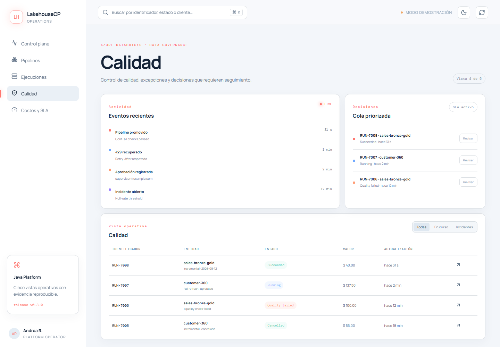 | 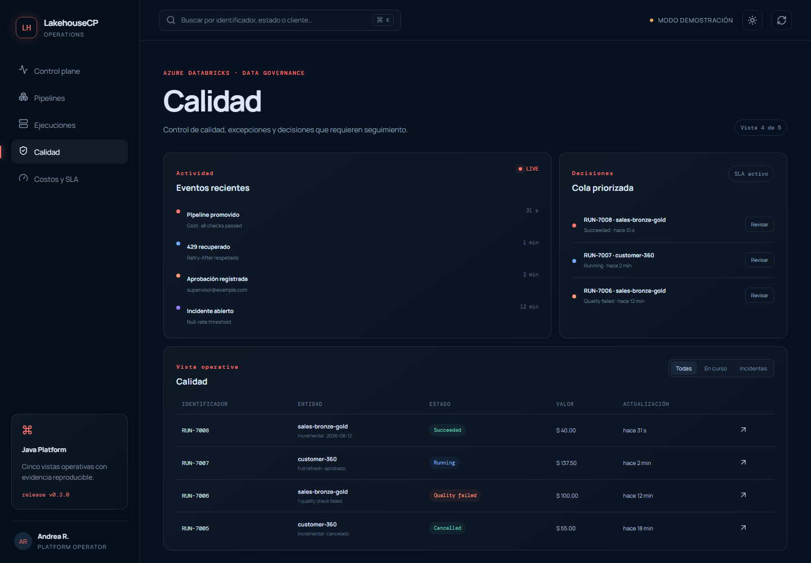 |
| Costos y SLA | 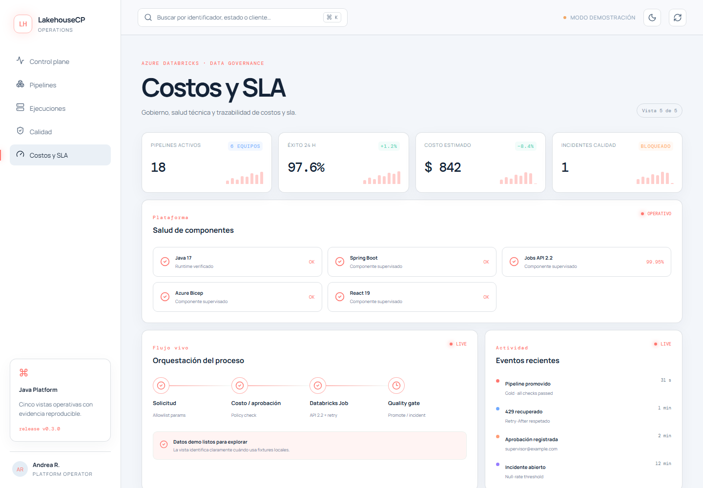 | 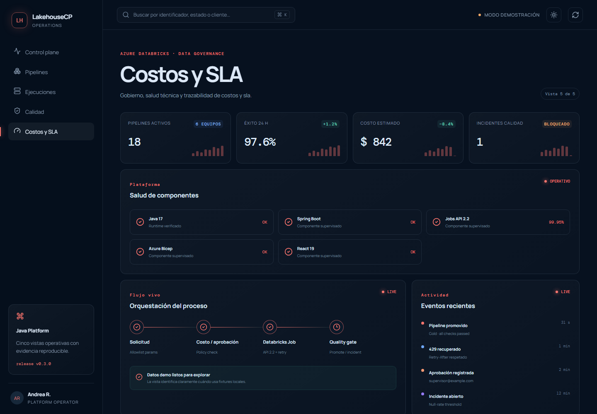 |

<p align="center">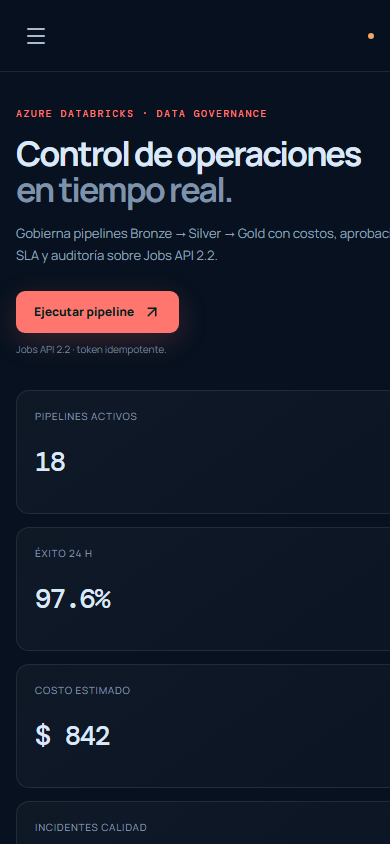</p>

---

## Arquitectura y ejecución

<p align="center">
  
</p>

<p align="center">
  
</p>

Consultar [arquitectura](docs/ARCHITECTURE.md) y
[runbook operativo](docs/RUNBOOK.md) para los escenarios de diagnóstico.

---

## Decisiones de diseño

- **Control plane separado del cómputo:** Java gobierna; Databricks ejecuta.
- **Parámetros por allowlist:** no se reenvía cualquier clave recibida desde
  Internet a un notebook.
- **Idempotencia nativa:** Jobs API recibe el UUID ya persistido como
  `idempotency_token`.
- **Costo antes de ejecución:** una operación cara puede detenerse antes de
  consumir infraestructura.
- **Calidad como gate:** `TERMINATED/SUCCESS` no equivale automáticamente a
  datos promovibles.
- **429 es recuperable:** el cliente respeta `Retry-After` y no crea una
  segunda ejecución.
- **Credenciales fuera del repositorio:** Managed Identity/OAuth sustituyen
  tokens personales versionados.

---

## Demo local completa

Requiere Java 17, Docker y Node.js 24.

```bash
docker compose up -d --wait
./gradlew bootRun
```

La API escucha en `http://localhost:8098` y el perfil local usa el simulador
incluido.

```bash
curl -X POST http://localhost:8098/api/v1/executions +  -H "Content-Type: application/json" +  -d '{"pipelineKey":"sales-bronze-gold","requestedBy":"ana@example.com","parameters":{"source_date":"2026-08-13","simulate_rate_limit":"true"}}'
```

Para simular fallo de calidad agregar `"fail_quality":"true"`. Un full
refresh sobre el umbral queda en `APPROVAL_REQUIRED`:

```bash
curl -X POST http://localhost:8098/api/v1/executions/{id}/approve +  -H "X-Role: DATA_APPROVER" -H "X-Actor: supervisor@example.com"
```

---

## API

| Método | Ruta | Uso |
|---|---|---|
| `POST` | `/api/v1/executions` | Solicitar ejecución |
| `GET` | `/api/v1/executions/{id}` | Estado y calidad |
| `POST` | `/api/v1/executions/{id}/approve` | Aprobar costo |
| `POST` | `/api/v1/executions/{id}/cancel` | Cancelar por rol |
| `GET` | `/api/v1/dashboard` | Resumen operativo |
| `GET` | `/actuator/prometheus` | Métricas |

---

## Pruebas y comandos

```bash
./gradlew clean test bootJar --no-daemon
cd frontend && npm ci && npm test && npm run build
```

| Comando | Resultado |
|---|---|
| `docker compose up -d --wait` | PostgreSQL local |
| `./gradlew bootRun` | Control plane + simulador |
| `./gradlew clean test` | Cost policy y catálogo |
| `pwsh scripts/verify.ps1` | Verificación integral |
| `pwsh scripts/render-diagrams.ps1` | Mermaid a SVG/PNG |

---

## Stack

| Capa | Tecnología |
|---|---|
| Backend | Java 17, Spring Boot 3.5 |
| Data platform | Azure Databricks Jobs API 2.2 |
| Persistencia | PostgreSQL, Spring JDBC, Flyway |
| Cloud | Azure Container Apps, Bicep, Managed Identity |
| Gobierno | Allowlist, costo, aprobación, quality gate |
| Observabilidad | Actuator, Prometheus, auditoría |
| Frontend | React 19, TypeScript 7, Vite 8 |
| Pruebas | JUnit, Testcontainers, Vitest |

---

## GitFlow

El gráfico reproduce el historial real hasta `v0.3.0`, desde las ramas de
trabajo hasta la release etiquetada y su reintegración en `develop`.

<p align="center">
  
</p>

`main` conserva releases; `develop` integra; `feature/*`, `docs/*`,
`fix/*`, `hotfix/*` y `release/*` separan cambios. Los merges son
`--no-ff`, los commits son convencionales y cada release tiene tag.

---

## Estructura

```text
lakehouse-control-plane/
├── src/main/java/              # Política, Jobs API, simulador y REST
├── src/main/resources/         # Configuración y Flyway
├── src/test/                   # Costos y catálogo con PostgreSQL
├── frontend/                   # Consola DataOps
├── databricks/                 # Artefactos de plataforma de datos
├── infra/                      # Bicep para Azure
├── docs/                       # Arquitectura, runbook y capturas
├── diagrams/                   # Arquitectura, flujo y GitFlow
├── scripts/                    # Verificación y render
├── Dockerfile
└── compose.yaml                # Demo local
```

---

## Autor

[Daniel Yataco Blas](https://github.com/danielyatacoblas) — autor principal
del diseño, implementación, pruebas y documentación.

## Licencia

[MIT](LICENSE) · Daniel Yataco Blas
